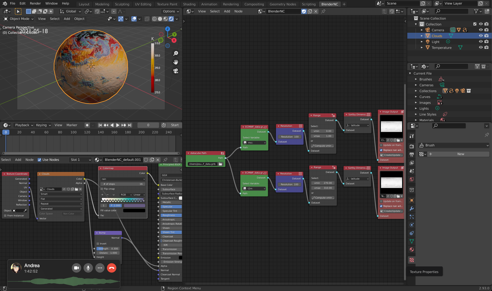
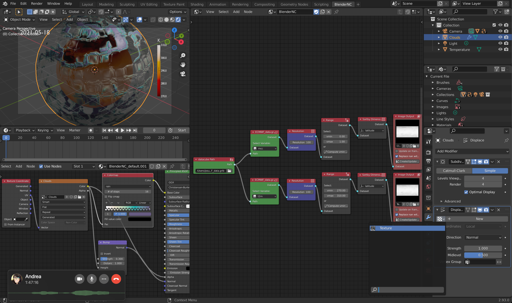

======================
Displacement animation
======================

.. raw:: html

    

.. role:: purple
.. role:: cyan
.. role:: orange
.. role:: green
.. role:: magenta

.. important::
    It is important to be familiar with the BlenderNC nodetree (:ref:`pro_mode`) to follow this tutorial, and have completed the previous tutorial: :ref:`ECMWF_netcdf` and :ref:`ECMWF_grib`.

Some data has been provided by ECMWF, and it is included at the main `BlenderNC <https://github.com/blendernc/blendernc>`_ repository in the path ``blendernc/test/dataset``.

::

    blendernc
    └── tests
        └── dataset
            ├── ECMWF_data.grib
            ├── ECMWF_data.nc
            ├── ssh_1995-01.nc
            └── ssh_1995-01.zarr

This example will use the file ``ECMWF_data.grib``, and builds up from the previous tutorial: :ref:`ECMWF_grib`.

:ref:`ECMWF_grib` finished by loading two datasets; mid cloud coverage (mcc) and surface temperature at 2m (t2m).

.. image:: ../../images/ecmwf_example/change_colormap_rain.png
  :width: 100%
  :class: with-shadow

In this tutorial will explore:

- creating a displacement of two cloud levels; mid cloud coverage (mcc) and low cloud coverage (lcc),
- animate three fields of the dataset,
- and render an animation.

Let's first add a displacement to the clouds:

1. In the property menu, switch to the texture property and create a new texture (Rename texture to ``mid_cloud``):

2. In the texture property menu assign the cloud image as source.

3. In the property menu, switch to the modifier property.

4. In the modifier property, add a subdivision modifier using the simple subdivision and increase the render subdivision.

.. important:: A larger number of subdivisions will increase the render time. By decreasing the ``levels of viewports`` the viewport responsiveness will increase.

5. Add a displacement modifier and select the texture (``mid_cloud``).

6. Switch the coordinates from ``Normal`` to ``UV``.

7. Now let's reduce the intensity of the displacement modifier strength to ``0.05``

.. note::
    You can play with any of the parameters; including the displacement texture in the texture property, to smooth and apply a gaussian filter to the image.

    .. image:: ../../images/displacement_animation/displacement_properties.png
        :width: 50%
        :class: with-shadow

To add another field, for example, the low cloud coverage (lcc), we can duplicate the cloud object (``UV sphere``) and rename it to ``Clouds_low``.

Now we will repeat a similar process, but first we need to create a new image containing the ``lcc`` variable in the ``BlenderNC`` nodetree:

Select the ``Clouds_low`` object and unlink the material by clicking over the number next to the material name.

Now, we can change the image source in the image texture node in the new material.

Similarly to the material, we now need to unlink the displacement texture in the texture property menu by clicking the number next to the name of the texture.

Change the displacement image source to the new image ``Clouds_low``.

Now, we can change the colorbar from the default ``thermal`` to ``gray`` for example:

Finally, play with the displacement midlevel to achieve a better interpretation of the low cloud coverage (``lcc``; `midlevel = -0.5`) and mid cloud coverage (``mcc``; `midlevel = -2`). For example, rendering with ``cycles``:

