==================
Import ECMWF cGrib
==================

.. raw:: html

    

.. role:: purple
.. role:: cyan
.. role:: orange
.. role:: green
.. role:: magenta

.. important::
    It is important to be familiar with the BlenderNC nodetree (:ref:`pro_mode`) to follow this tutorial, and have completed the previous tutorial: :ref:`ECMWF_netcdf`.

Some data has been provided by ECMWF, and it is included at the main `BlenderNC <https://github.com/blendernc/blendernc>`_ repository in the path ``blendernc/test/dataset``.

::

    blendernc
    └── tests
        └── dataset
            ├── ECMWF_data.grib
            ├── ECMWF_data.nc
            ├── ssh_1995-01.nc
            └── ssh_1995-01.zarr

This example will use the file ``ECMWF_data.grib``, and builds up from the previous tutorial: :ref:`ECMWF_netcdf`.

:ref:`ECMWF_netcdf` finished by fixing the colormap, material orientation, and
updating the colorbar.

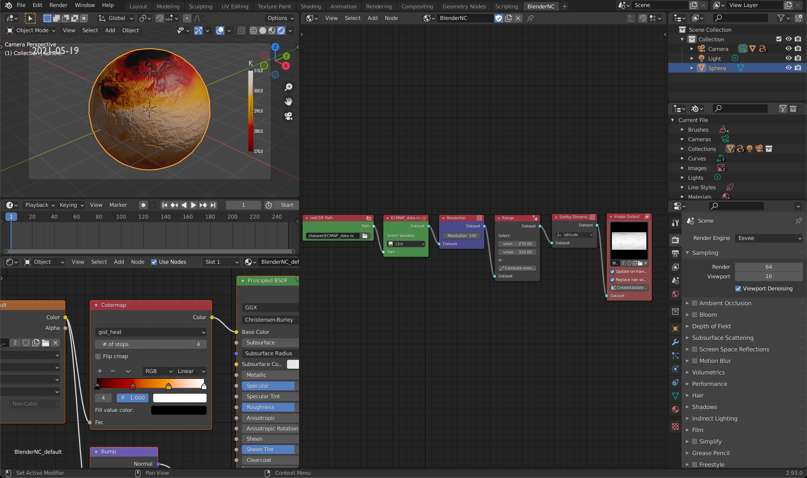

In this tutorial will explore:

- reading the same dataset but in  ``grib`` format,
- explore some of the BlenderNC user preferences,
- and visualise two fields from the same dataset.

1. Let's change to the ``grib`` file, by browsing using the node ``netCDF Path``, higlight in :purple:`purple`.

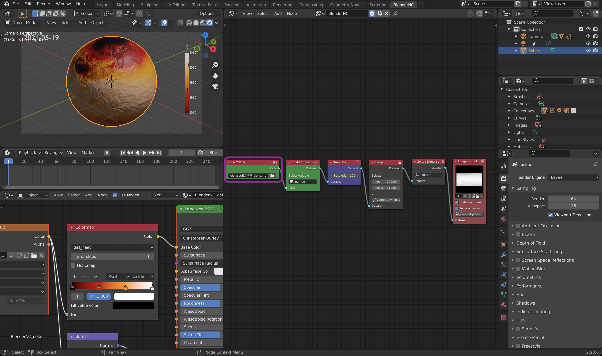

.. important::
    You may need to reselect the variable ``t2m``, however you won't be able to note any change.

    .. image:: ../../images/ecmwf_example/reselect_variable.png
      :width: 100%
      :class: with-shadow

2. Select all the nodes except for the ``netCDF Path`` node, by clicking and draging over the **BlenderNC** nodetree.

3. Click ``shift + D`` to duplicate the nodes, drag them up, to look like:

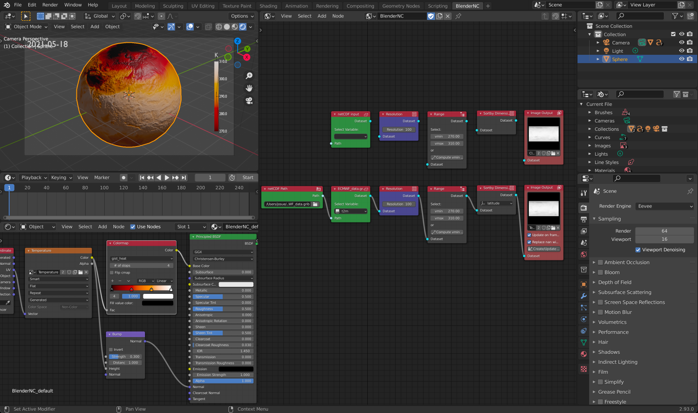

4. Now we will connect the nodes and select a different variable "Medium Cloud cover" (``mcc``):

5. Continue connecting the nodes until the ``Range`` node, here, let's update the variable range. The cloud variable has a range of [0,1].

6. Connect all the nodes:

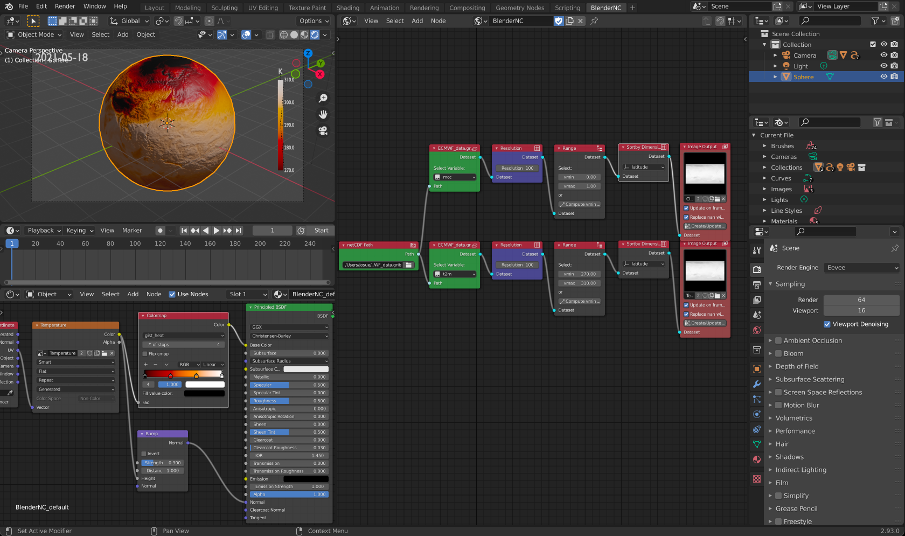

7. To make our life easiers, we will rename both images to "Clouds" and "Temperature". You can rename the images by clicking below the image preview higlighted in :cyan:`cyan`.

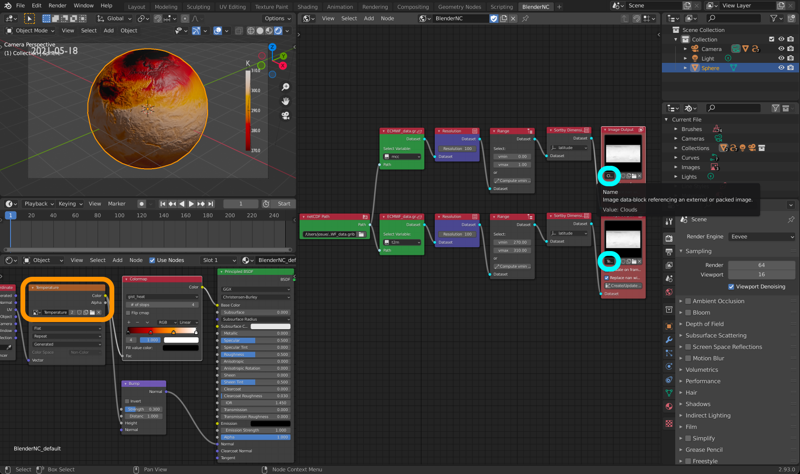

.. note::
  After you rename the image, you will be able to notice the change of the name in the material (see previous image higligted in :orange:`orange`). Also if you click over the image preview in the ``Image output`` node, you will see:

  .. image:: ../../images/ecmwf_example/image_preview.png
    :width: 40%
    :class: with-shadow

8. Let's add another sphere, you can simply press ``shift+D+Return`` to duplicate the existing sphere. Let's also rename the spheres to keep track of our workflow.

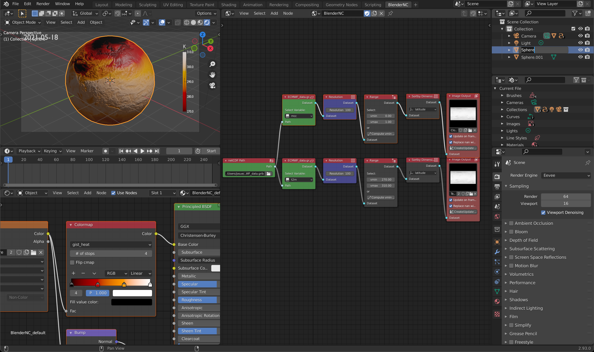

9. Both spheres have the same material, thus we will add a new material, by clicking the icon higlighted in :green:`green`.

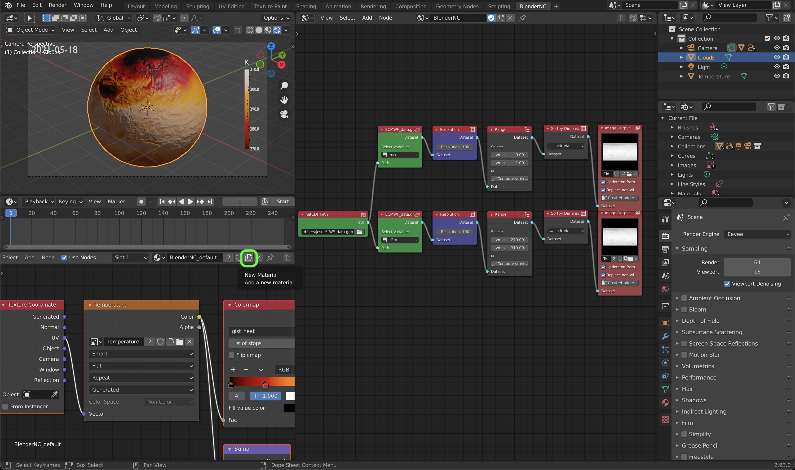

10.  Let's change the image used in the material to the image "Clouds". This is why is useful to change the image and object names.

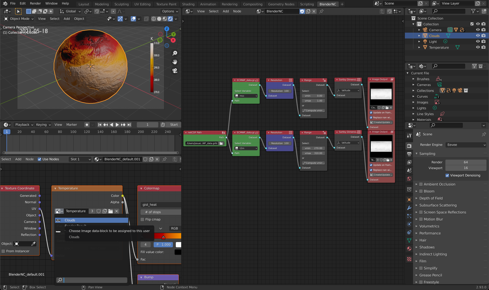

11.  Now, we can only see the "Clouds", in order to have an animation with two fields, we will add an alpha channel to the clouds, by connecting the output of the "Clouds" ``image texture`` output to the alpha input of the ``Principal BSDF``(highlighted in :magenta:`magenta`).

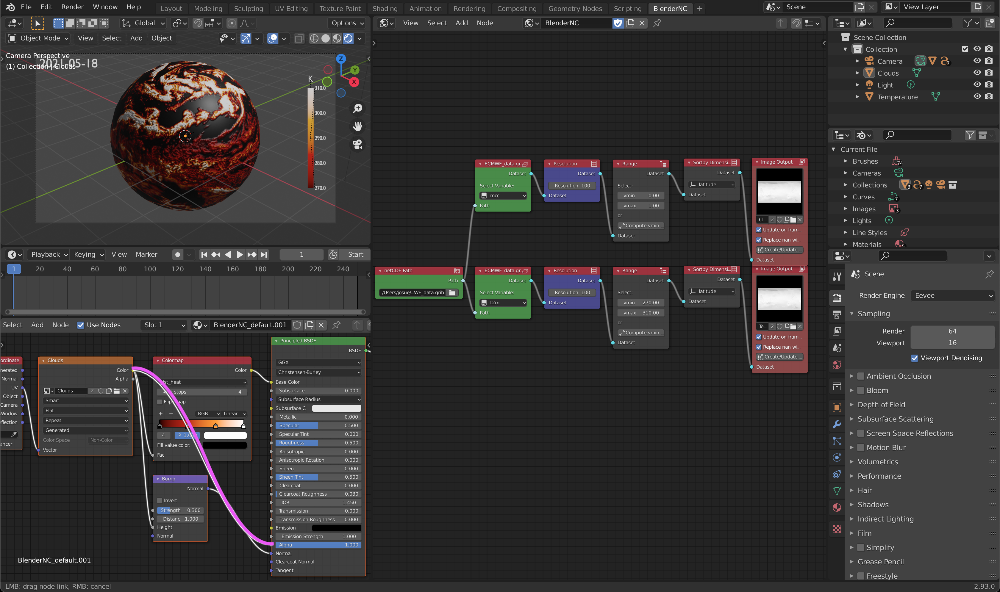

.. note::
  If you are using Eevee as a Render Engine, you will need to change some the material settings (Click over the material settings, higlighted in :cyan:`cyan`):

  .. image:: ../../images/ecmwf_example/material_settings.png
    :width: 100%
    :class: with-shadow

  Then select the ``Blend Mode`` to ``Alpha Blend``, optionally you can allow `Show Backface`.

  .. image:: ../../images/ecmwf_example/select_blend_mode.png
    :width: 100%
    :class: with-shadow

12. After you apply the alpha channel, you should be able to see both spheres:

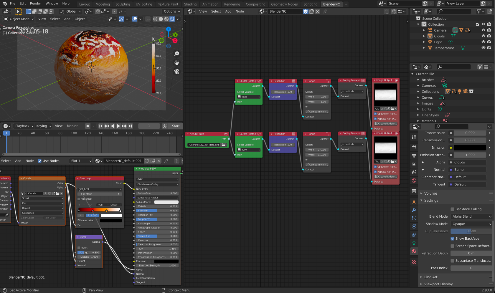

13. We are using the same colormap for both datasets and it's confusing. We can change the colormap, of the "Clouds" by selecting the clouds object, then change the colormap.

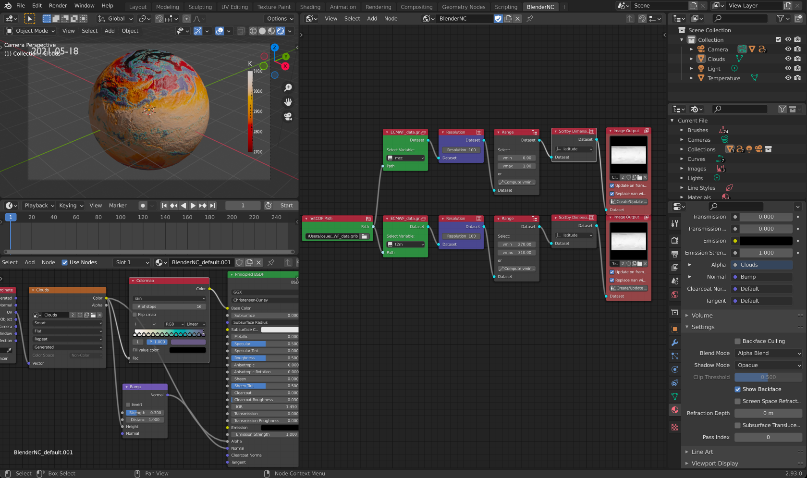

.. note:: Instead of using the same dataset, now you can experiment by adding another ``netCDF Path`` node and use a different dataset and animating multiple variables.

If you render the image (press ``F12``), your image should resemble:

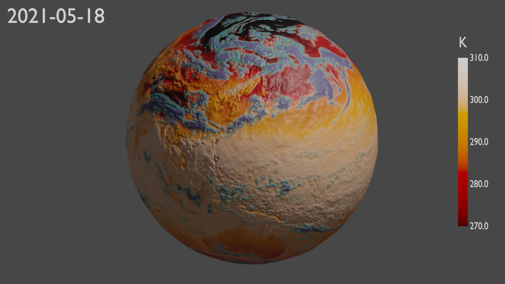