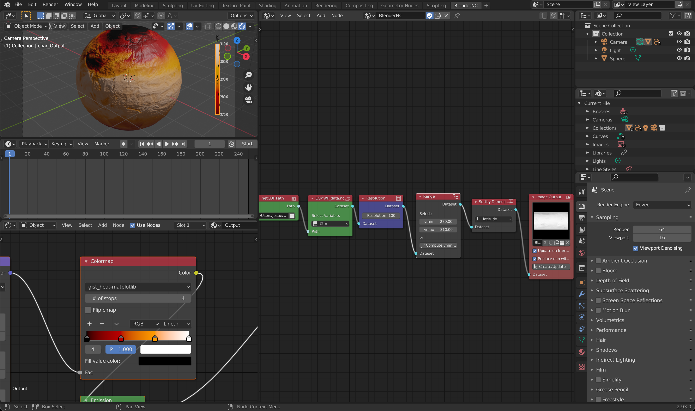

==================
Import ECMWF cGrib
==================

.. important::
    It is important to be familiar with the BlenderNC nodetree (:ref:`pro_mode`) to follow this tutorial, and have completed the previous tutorial: :ref:`ECMWF_netcdf`.

Some data has been provided by ECMWF, and it is included at the main `BlenderNC <https://github.com/blendernc/blendernc>`_ repository in the path ``blendernc/test/dataset``.

::

    blendernc
    └── tests
        └── dataset
            ├── ECMWF_data.grib
            ├── ECMWF_data.nc
            ├── ssh_1995-01.nc
            └── ssh_1995-01.zarr

This example will use the file ``ECMWF_data.grib``, and builds up from the previous tutorial: :ref:`ECMWF_netcdf`.

:ref:`ECMWF_netcdf` finished by fixing the colormap, material orientation, and
updating the colorbar.

In this tutorial will explore:

- reading the same dataset but in  ``grib`` format,
- explore some of the BlenderNC user preferences,
- and visualise two fields from the same dataset.

