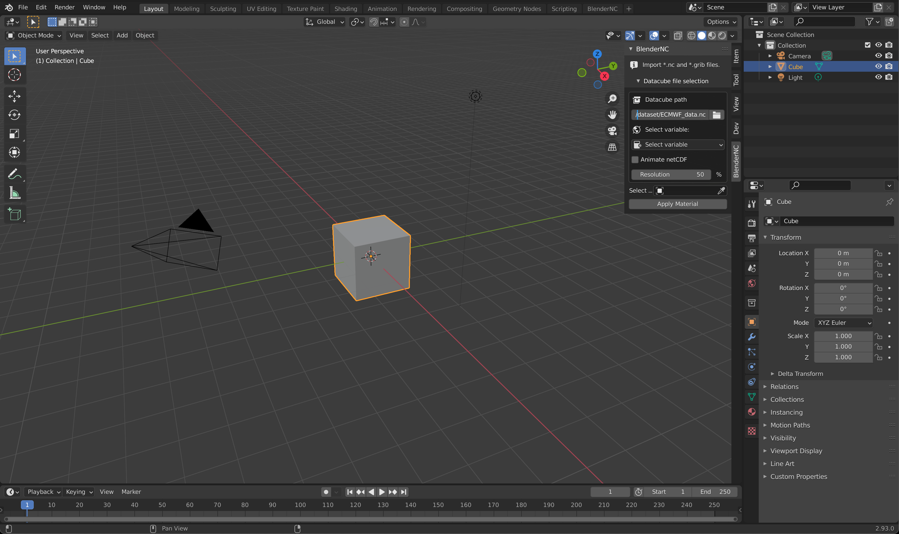
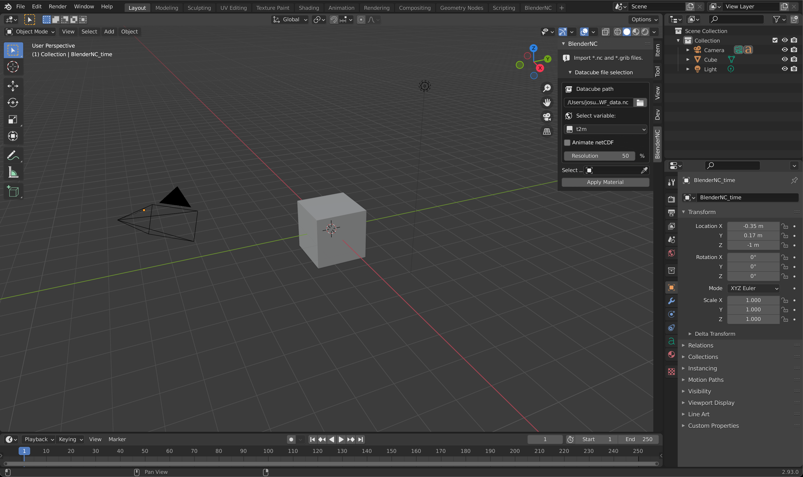
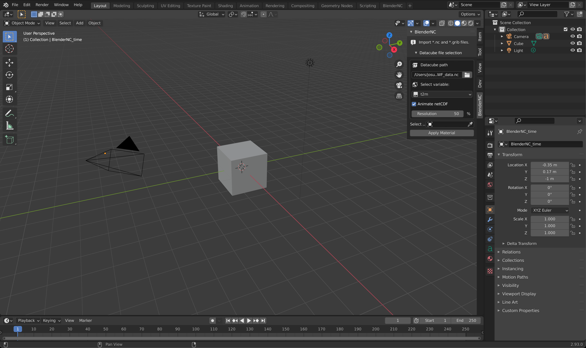
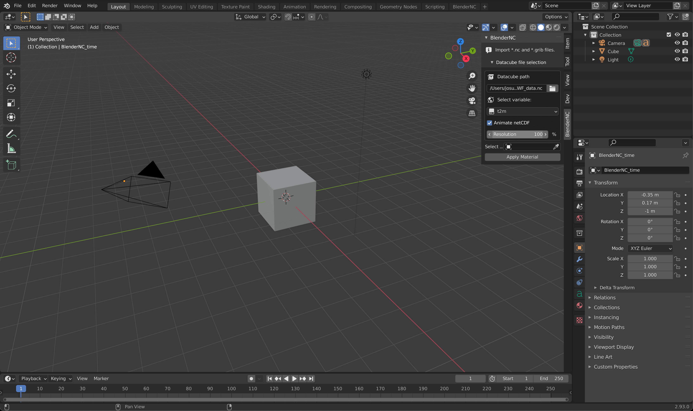
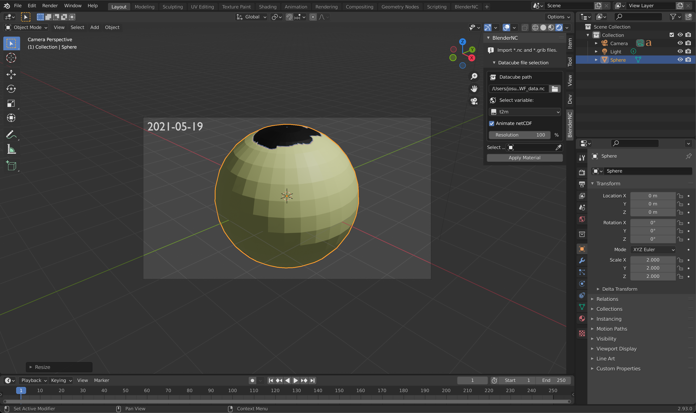
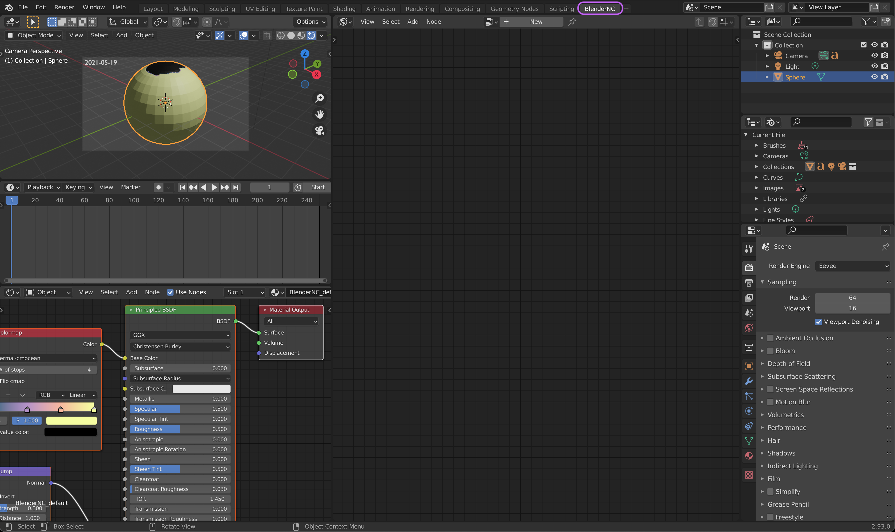

===================
Import ECMWF netCDF
===================

.. raw:: html

    

.. role:: purple
.. role:: cyan

.. important::
    It is important to be familiar with the simple UI of BlenderNC (:ref:`beginner_mode`) to follow this tutorial.

Some data has been provided by ECMWF, and it is included at the main `BlenderNC <https://github.com/blendernc/blendernc>`_ repository in the path ``blendernc/test/dataset``.

::

    blendernc
    └── tests
        └── dataset
            ├── ECMWF_data.grib
            ├── ECMWF_data.nc
            ├── ssh_1995-01.nc
            └── ssh_1995-01.zarr

This example will use the file ``ECMWF_data.nc``, follow closely the previous tutorial :ref:`simple_example`, and explore the BlenderNC.

Import data!
------------

Open Blender (>2.83), in the 3D view, open the `sidebar` by pressing "n".

- Switch to the BlenderNC panel and click on ``Load netCDF``. Then click the folder icon, navigate and select the ecmwdf netcdf dataset: ``blendernc/test/dataset/ssh_1995-01.nc``

- Select the variable ``t2m`` from this dataset (Air-Temperature at 2 meters):

- Click over the animation checkbox to allow the dataset to be animated.

- Let's increase the resolution to 100%:

- Now, we can apply the material BlenderNC just created, but first, lets delete the default cube (shortuct ``x``), create a sphere (shortcut ``shift + a`` - ``Mesh -> UV Sphere``), and scale it to ``2x`` (shortcut ``s + 2 + return``)

- Select sphere by clicking over it, then click apply material (highlighted in blue above). There will be no visible change until we switch to a rendered 3D viewport (``Z`` and click over ) or render the camera (shortcut ``F12``). Press ``0`` in your number path to change your view to the camera view. If you are using a laptop, you can emulate a number path by following the instructions in this `link <https://docs.blender.org/manual/en/latest/editors/preferences/input.html>`__!

.. note::
    So far there is noting new, but the render preview looks awful, we will fix it using the BlenderNC nodetree.

BlenderNC nodetree
------------------

Let's switch to the BlenderNC nodetree, we have two options:

- Switch to :purple:`BlenderNC workspace` (recomended):

- or switch viewport to the BlenderNC nodetree:

.. image:: ../../images/ecmwf_example/change_nodetree.png
  :width: 100%
  :class: with-shadow float-left

By default, the `3D view` **BlenderNC** panel will create 4 nodes ``netCDF Path, netCDF input, Resolution, Image Output``, as seen below:

.. image:: ../../images/ecmwf_example/selected_nodetree.png
  :width: 100%
  :class: with-shadow float-left

.. note::
  The node ``netCDF input`` changes name to the current loaded filename.

Let's fix some of the issues:

1. Fix washed out colormap:

   -  Import netCDF range by pressing ``shift+a`` and then navegate to ``Datacube``, then select ``netCDF Range``.

   .. image:: ../../images/ecmwf_example/add_range_node.png
    :width: 100%
    :class: with-shadow float-left

   -  This will add a new node. The node will automatically connect if you place it between the ``resolution`` and ``Image Output`` nodes.

   .. image:: ../../images/ecmwf_example/connect_range_node.png
    :width: 100%
    :class: with-shadow float-left

   .. note::
    The previous step created a colorbar, as you can see, the values are rely low, and that's why the render preview is awful.

   -  To fix this, lets first connect the ``Range`` to the ``Image Output`` node. You can do this by draging the :cyan:`cyan dot` on the top-right of the ``Range`` node to the bottom-left :cyan:`cyan dot` on the ``Image Output``.
   -  Once connected, we can compute the range of the dataset by clicking over the ``Compute vmin & vmax`` button or directly change the vmin and vmax, this will automatically update the colorbar too. The range of this dataset is [204.11 - 312.75] Kelvins.

   .. image:: ../../images/ecmwf_example/output_range_node.png
    :width: 100%
    :class: with-shadow float-left

2. Fix Earth upside-down:

  .. note::
    Now that we can actually see the data, it's obvious that the Earth is upside-down. This will be fixed in a future release, but in the meantime there are two hacks to fix it.

  - Easy fix:

    - Select the Sphere.
    - Rotate 180 degrees in the X or Y axis by pressing ``r + x + 180`` on your keyboard.

  - Fix using BlenderNC nodetrees:

    -

