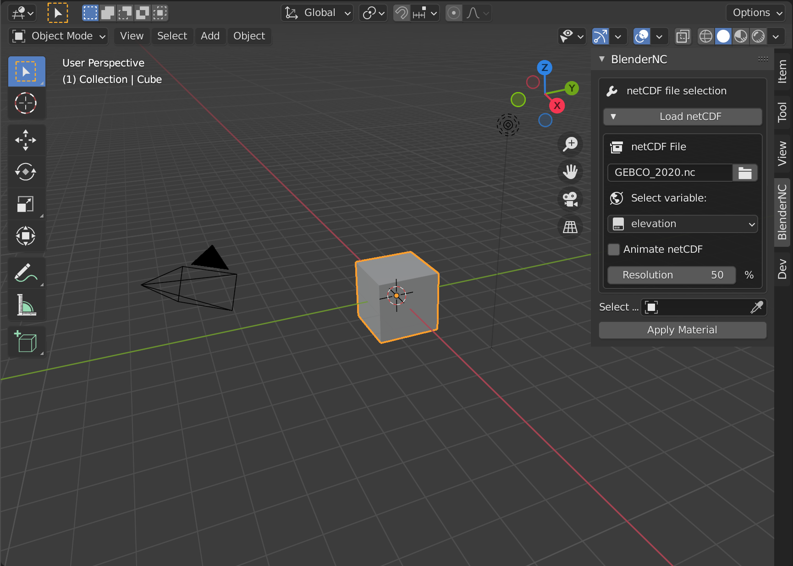
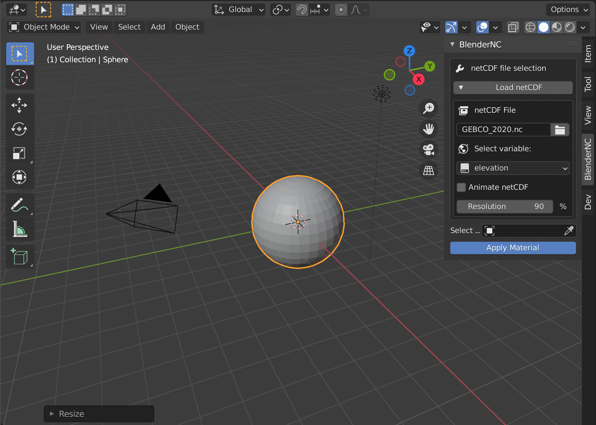
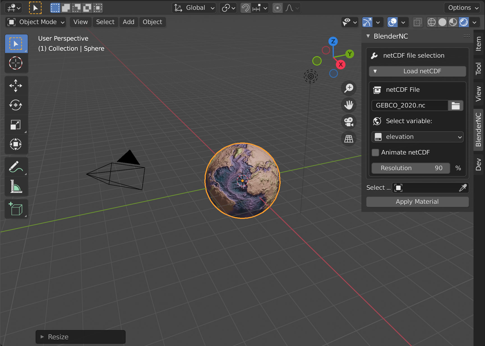
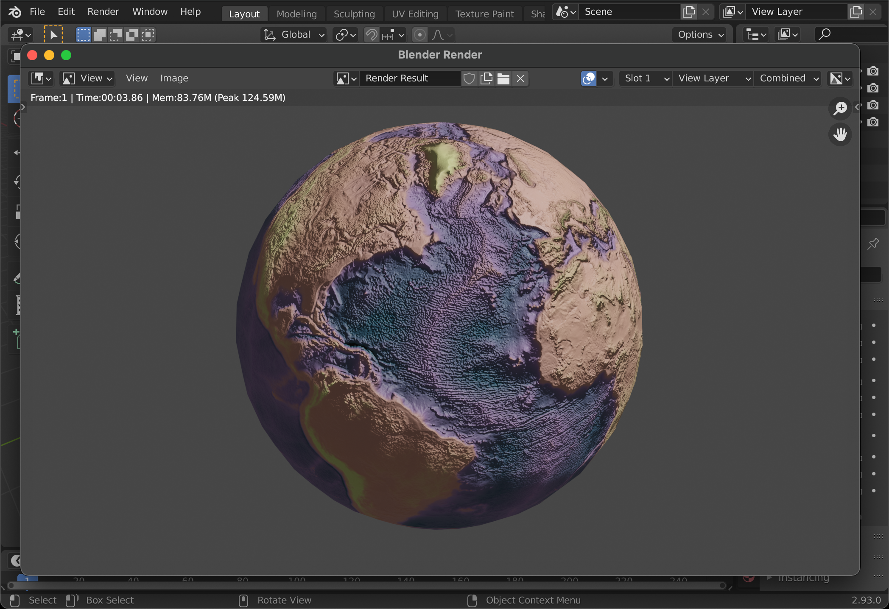
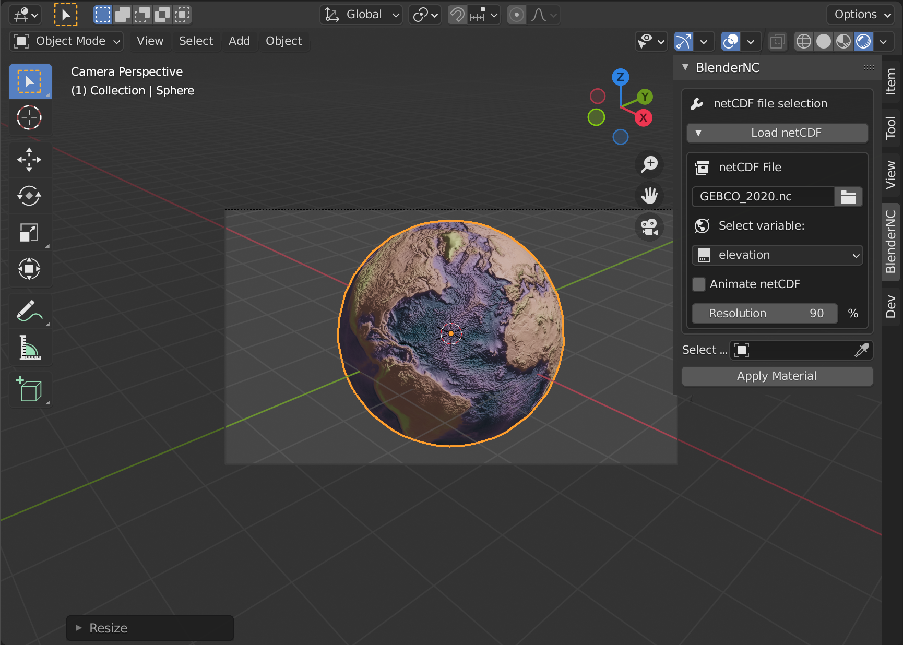

=======================
Import Gebco Topography
=======================

.. important::
  For this first example, it is important to be familiar with the simple UI of BlenderNC (:ref:`beginner_mode`).

Download the GEBCO bathymetry dataset (`for more info click here <https://www.gebco.net/data_and_products/gridded_bathymetry_data/gebco_2020/>`__) or download it directly by clicking `here <https://www.bodc.ac.uk/data/open_download/gebco/gebco_2020/zip/>`__!

Open Blender (>2.83), in the 3D view, open the `sidebar` by pressing "n".

- Switch to the BlenderNC panel and click on ``Load datacube``. Then click the folder icon, navigate and select the GEBCO bathymetry netCDF.

.. image:: ../../images/gebco_example/gebco_select_file.png
  :width: 100%
  :class: with-shadow

- Select variable (``elevation``):

.. important::
  Due to the size of the GEBCO dataset, BlenderNC will raise an issue saying ``Increase resolution`` (highlighted with red below). The resolution of a dataset is logarithmic, for more information about how is the resolution defined, check resolution_description.

  .. image:: ../../images/gebco_example/gebco_resolution_error.png

- Let's increase the resolution to 90%:

- Now, we can apply the material BlenderNC just created, but first, lets delete the default cube (shortuct ``x``), create a sphere (shortcut ``shift + a`` - ``Mesh -> UV Sphere``), and scale it to ``2x`` (shortcut ``s + 2 + return``)

- Select sphere by clicking over it, then click apply material (highlighted in blue above).

There will be no visible change until we switch to a rendered 3D viewport (``Z`` and click over ) or render the camera (shortcut ``F12``).

Press ``0`` in your number path to change your view to the camera view. If you are using a laptop, you can emulate a number path by following the instructions in this `link <https://docs.blender.org/manual/en/latest/editors/preferences/input.html>`__!

Let's bring it all together into a short video:

.. image:: ../../images/BlenderNC_gebco.gif
  :width: 100%
  :alt: BlenderNC workspace