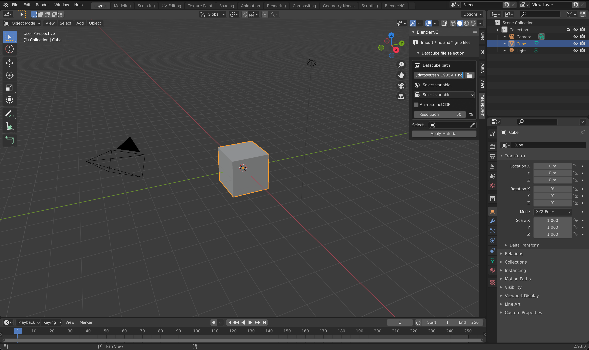
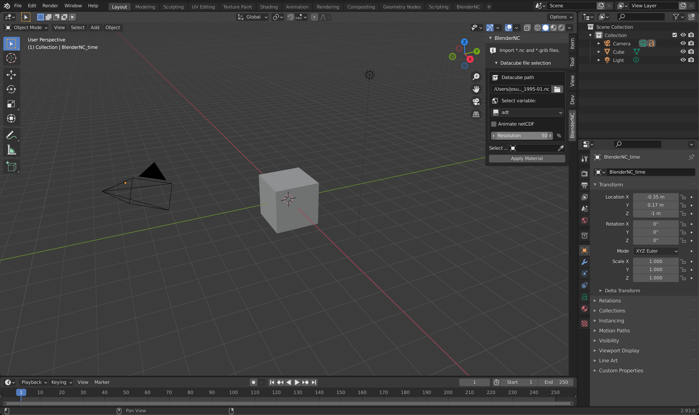
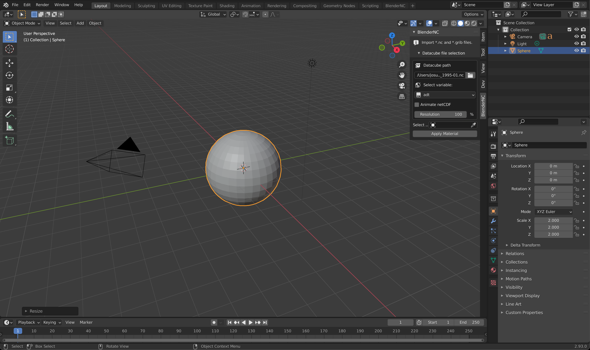
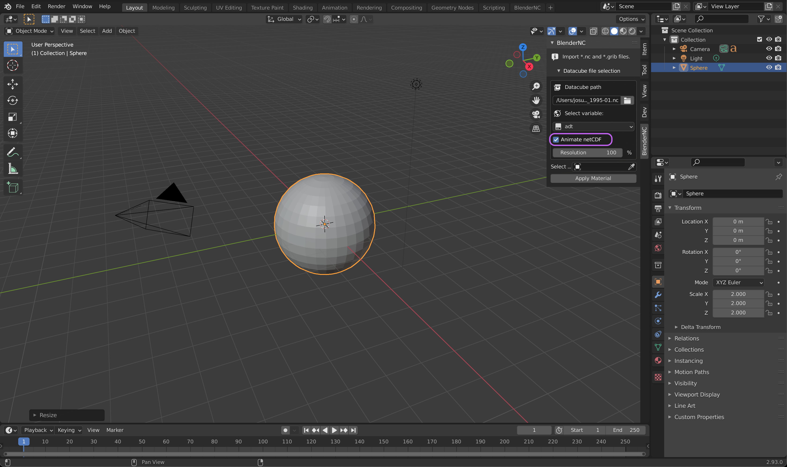
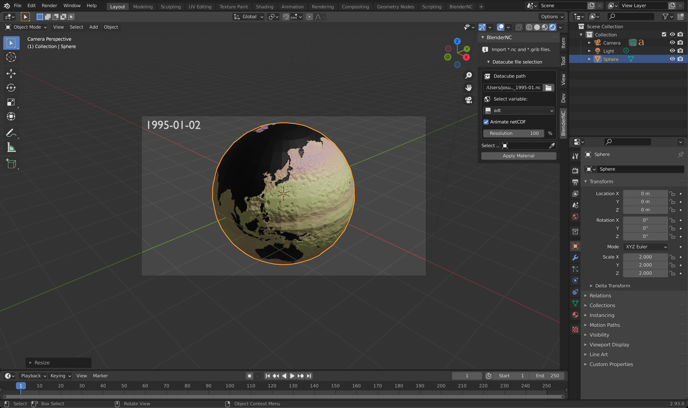
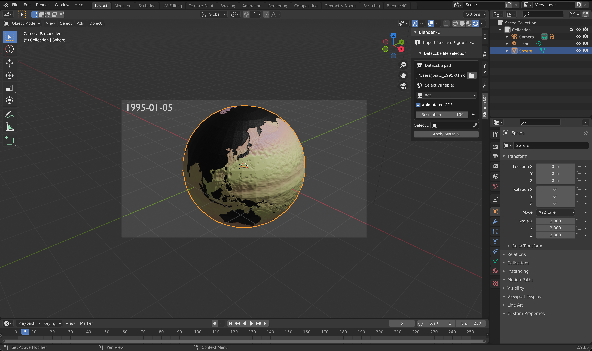

.. _simple_example:

================
Simple animation
================

.. raw:: html

    

.. role:: purple

.. important::
    For this third example, it is important to be familiar with the simple UI of BlenderNC (:ref:`beginner_mode`).

Data
----

The data provided can be found at the main `BlenderNC <https://github.com/blendernc/blendernc>`_ repository in the path ``blendernc/test/dataset``.

.. code-block:: bash

    blendernc
    └── tests
        └── dataset
            ├── ECMWF_data.grib
            ├── ECMWF_data.nc
            ├── ssh_1995-01.nc
            └── ssh_1995-01.zarr

Optionally, you can access more data by following the instructions at :ref:`download_more_data`

Independent to the data you decide to download or use, the following process will be identical.

Import data!
------------

Open Blender (>2.83), in the 3D view, open the `sidebar` by pressing "n".

- Switch to the BlenderNC panel and click on ``Load netCDF``. Then click the folder icon, navigate and select a dataset, for example: `blendernc/test/dataset/ssh_1995-01.nc`.

- Select variable (``adt`` for example dataset):

- Let's increase the resolution to 100%:

- Now, we can apply the material BlenderNC just created, but first, lets delete the default cube (shortuct ``x``), create a sphere (shortcut ``shift + a`` - ``Mesh -> UV Sphere``), and scale it to ``2x`` (shortcut ``s + 2 + return``)

- Click in the check box next to ``Animate netCDF`` highlighted in :purple:`purple`. This option can be selected at anytime during.

- Select sphere by clicking over it, then click apply material (highlighted in blue above). There will be no visible change until we switch to a rendered 3D viewport (``Z`` and click over ) or render the camera (shortcut ``F12``). Press ``0`` in your number path to change your view to the camera view. If you are using a laptop, you can emulate a number path by following the instructions in this `link <https://docs.blender.org/manual/en/latest/editors/preferences/input.html>`__!

- Once you are in the camera mode, press ``Spacebar`` on your keyboard to play the animation. Voila! now we have a netCDF animation. Also, you can change frames, for example, change to frame `5`, and the material will be updated.

