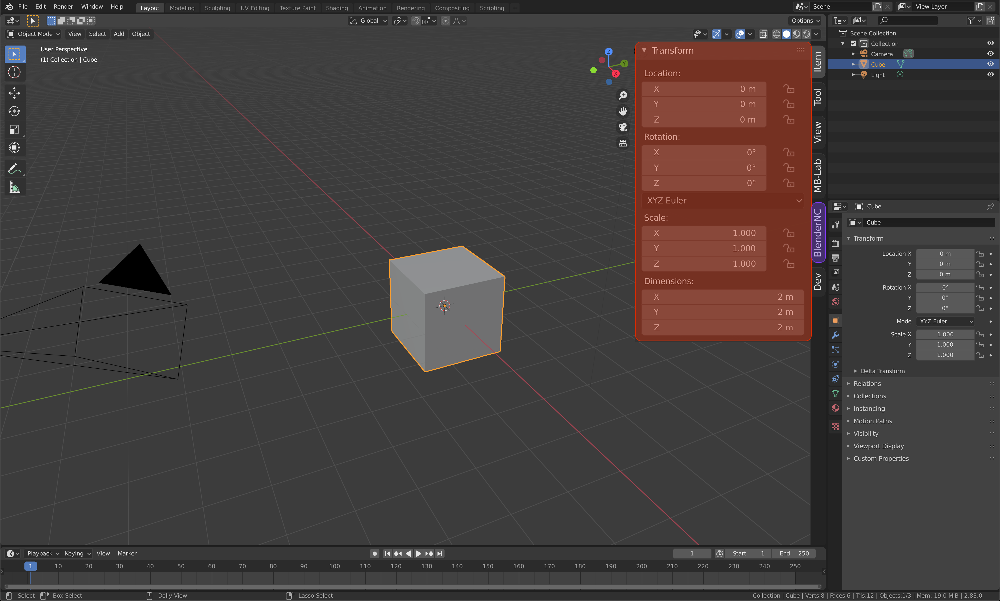
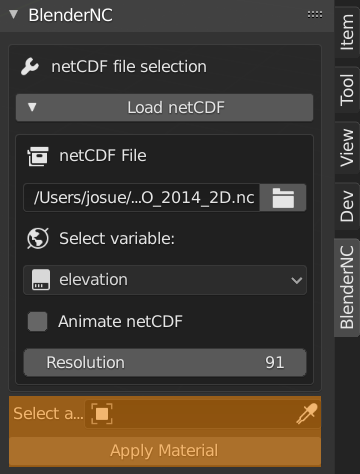

====================
How to use BlenderNC
====================

Beginner mode!
##############

.. raw:: html

    

.. role:: red

.. role:: purple

.. role:: green

.. role:: orange

.. role:: teal

Open Blender (>2.83), in the 3D view open the :red:`sidebar` by pressing "n".

Switch to the :purple:`BlenderNC panel`.

.. image:: ../images/blendernc_ui.png
  :width: 100%
  :alt: BlenderNC panel

Within the :purple:`BlenderNC panel` click on `Load netCDF`, then select a 
netCDF by clicking the :green:`folder icon`.

.. image:: ../images/blendernc_panel.png
  :width: 30%
  :alt: BlenderNC panel

:teal:`Select a variable` and the :teal:`resolution` to load. 

.. image:: ../images/variable_panel.png
  :width: 30%
  :alt: BlenderNC panel

Select an object and apply the material by clicking 
:orange:`Apply Material`.

To animate the netCDF in time click over "**Animate netCDF**". Press **space** 
in your keyboard to visualize animation.

.. note:: The material will be applied to the selected object.

The `Beginner mode` creates the basic nodes in the BlenderNC Editor. To acces it,

PRO mode!
#########

