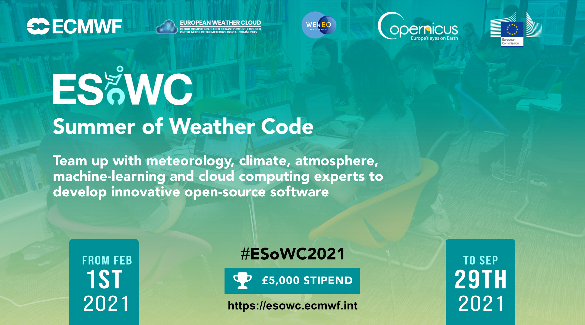

.. blendernc documentation master file, created by
   sphinx-quickstart on Sun May 31 19:41:12 2020.
   You can adapt this file completely to your liking, but it should at least
   contain the root `toctree` directive.

Welcome to BlenderNC's documentation!
=====================================

=========
BlenderNC
=========

**BlenderNC** is a Blender add-on that allows to import netCDF files into
Blender. It allows 2D and 3D visualization and generation of scientific data
animations. The main development of *BlenderNC* is currently focus in
geo-spatial data (i.e. Oceanographic - Atmospheric data), however, the framework
should support the load of any netCDF.

.. image:: ../images/GEBCO_blendernc.png
  :width: 100%
  :alt: GEBCO Bathymetry (5400x2700 pixels)

.. toctree::
   :maxdepth: 2
   :caption: Quick Start

   install
   howtouse

.. toctree::
   :maxdepth: 2
   :caption: Dive in!

.. toctree::
   :maxdepth: 2
   :caption: Examples

   examples/import_gebco_netCDF
   examples/simple_animation
   examples/import_ECMWF_netCDF
   examples/import_ECMWF_grid
   examples/multiple_field_animations
   examples/irregular_grid

.. toctree::
   :maxdepth: 2
   :caption: API Nodes

   modules/blendernc_nodes_cmap
   .. TODO fix relative import for other nodes.
   .. modules/blendernc_nodes_inputs

.. toctree::
   :maxdepth: 2
   :caption: API Reference

   modules/blendernc_python_functions
   modules/blendernc_handlers
   modules/blendernc_decorators
   modules/blendernc_image
   modules/blendernc_errors

.. toctree::
   :caption: Help & References

   help

Indices and tables
==================

* :ref:`genindex`
* :ref:`modindex`
* :ref:`search`

Support
=======

BlenderNC was part of the `ECMWF Summer of Weather Code 2021 <https://esowc.ecmwf.int/>`_, an innovation program organised by the
`European Centre for Medium-Range Weather Forecasts <https://www.ecmwf.int>`_ focusing on weather- and climate-related open-source developments.
The sponsored work was aimed at improving the support of weather and climate data in GRIB format.

Community
=========

This section show animations submitted by the BlenderNC users.

.. image:: ../images/example_PT_city.gif
  :width: 100%
  :alt: Potential temperature.

The animation by `JoshuaB-L
<https://github.com/JoshuaB-L>`_ shows equivalent potential temperature (theta-e) of a diabatic process - air moving across a warming urban surface from 10-11:00am on the 16.07.2018 at Potsdamer Platz, Berlin. The wind speed is 7.2 km/ h considered a factor of 2 on the Beaufort Scale (‘Light breeze’). The temperature scale is represented in Kelvin and can be translated to celsius as a min and max value of 20.85 °C - 28.65 °C. Convection of the rising air parcels is clearly visible from the ground and building surfaces. Heat transfer occurs due the mixing of warm air (at ground level z0) and cool air (above the building canopy), caused by the turbulent rising eddies. Thus, the ambient air temperature of the urban environment rises. The simulation model used is PALM in LES mode. More information can be found `here <https://palm.muk.uni-hannover.de/trac/wiki/doc/tut/palm>`_.

