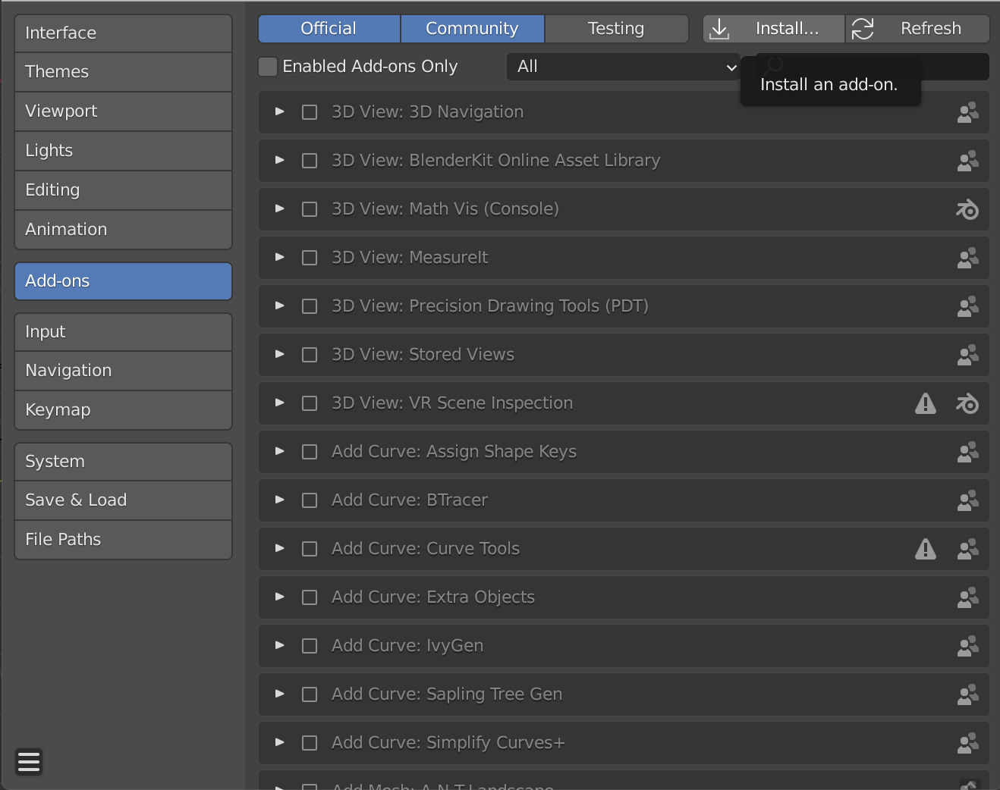
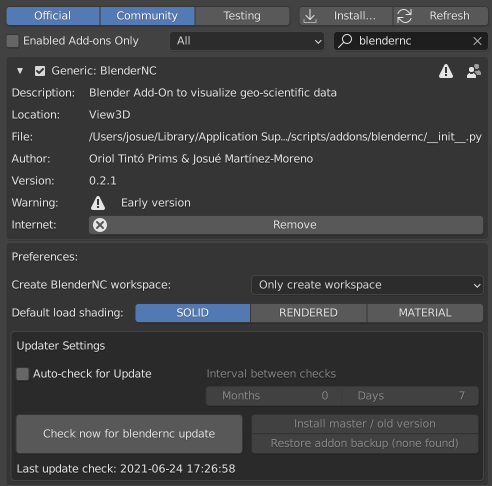

.. _install_blendernc:

=================
Install BlenderNC
=================

.. note::
    BlenderNC is supported by versions of **Blender > 2.8**.

Setting up the Blender Python environment
=========================================

BlenderNC requires the following python modules to be installed in Blender's Python environment:

.. code-block:: bash

    numpy
    zarr
    ecmwflibs
    cfgrib
    xarray[complete]
    cmocean
    matplotlib
    dask
    scipy
    netCDF4
    toolz
    pooch
    psutil

To install the previous python modules in your Blender distribution execute the
following commands depending on your OS:

macOS
-----

.. code-block:: bash

    BLENDERPY=/Applications/Blender.app/Contents/Resources/2.XX/python/bin/python3.7m
    $BLENDERPY -m ensurepip
    $BLENDERPY -m pip install -r requirements.txt

Linux
-----

.. code-block:: bash

    BLENDERPY=/path/to/blender/2.83/python/bin/python3.7m
    $BLENDERPY -m ensurepip
    $BLENDERPY -m pip install -r requirements.txt

Windows
-------

.. code-block:: bash

    set BLENDERPY=/path/to/blender/2.82/python/bin/python.exe
    %BLENDERPY%-m ensurepip
    %BLENDERPY% -m pip install -r requirements.txt

or install the following requirements using:

.. code-block:: bash

    $BLENDERPY -m pip install -r numpy cython zarr ecmwflibs cfgrib xarray[complete] cmocean matplotlib dask scipy netCDF4 toolz pooch psutil

Another, but **not recommended** option is to symbolically link your python modules to blender, first find the folder `modules` within the blender.app:

- macOS:

    .. code-block:: bash

        cd /Applications/Blender.app/Contents/Resources/2.9{X}/scripts/modules

- Linux and Windows:
    Go to the directory where Blender is installed and look for the ``modules`` folder

Then link all the packages from your python environment folder:

.. code-block:: bash

    ln -s $PATH_PYTHON/lib/python3.6/site-packages/* .

Install Addon
=============

The addon is installed just like any other Blender addon:

* Get a **BlenderNC** installable zip:

  1. (Recommended) Download the pre-generated zip from the `GitHub <https://github.com/blendernc/blendernc-zip-install>`_, or download the `current version zip <https://github.com/blendernc/blendernc-zip-install/raw/master/blendernc.zip>`_ (do not unzip it!).

  .. note::
      Under macOS - Safari downloading a .zip file will by default unzip it. You can fix this by:

      #. Manually zip the blendernc folder, or

      #. change Safari preferences:

    - Manually zip the blendernc folder.
    - Change Safari preferences:

        * Open Safari

        * Click Preferences

        * Under the General tab, uncheck the option Open “safe” files after downloading

  2. Clone BlenderNC and zip compress only the blendernc folder within the repository (i.e. ``blendernc/blendernc``). Use your generated ``blendernc.zip`` in the following steps.

* In Blender go to the user preferences and open the **Addons** tab.

* Once there, click **Install add-on from file** (bottom right corner)

* Navigate to the downloaded zip, select it, and click in install.

* Finally, check the box next to the `BlenderNC` addon, to enable it.

Now you can follow the tutorials to import datacubes in Blender.

Optionally, **but not recommended**, you can link or copy the blendernc folder within the repository (i.e. ``blendernc/blendernc``) to your preferred blender add-on path. You can get the exact path by running within a Blender Console:

.. code-block:: python

    bpy.utils.user_resource("SCRIPTS", path="addons")

output example on:

- macOS:

    .. code-block:: bash

        '/Users/{username}/Library/Application\ Support/Blender/2.9{X}/scripts/addons'

- Linux:

    .. code-block:: bash

        '/usr/share/blender/2.9{X}/scripts/addons'

- Windows 10:

    .. code-block:: bash

        '%USERPROFILE%\AppData\Roaming\Blender Foundation\Blender\2.9{X}\scripts\addons'

make sure you replace everything within the {}.

Update BlenderNC
================

A blender addon autoupdater has been implemented, for more information refer to
`blender-addon-updater <https://github.com/CGCookie/blender-addon-updater>`_. In order to update the BlenderNC:

- Navegate to the user preferences and open the **Addons** tab.

- Search for **BlenderNC**.

- Click in *Check for new blendernc update*.

  * Optionally, you can set **BlenderNC** to check automatically for updates.

- After checking for updates, select the branch you will like to install or release.

.. important::
    - The `master` branch contains the most recent bug fix (recommended).
    - The release mark milestones in the development, you can revert to them by selecting any `release x.x.x`. The latest release will point closely to `master`.
    - The `dev` branch is experimental and constantly changing, recommended if you are developing **BlenderNC**.

Optionally, you can do this process manually by uninstall the old version first. Thein install the new version of `BlenderNC`.

.. note:: You can just reinstall `blendernc` if you have enabled the ``Overwrite`` option in Blender (enabled by default). Then automatically the new addon zip will replace the old version.

Restart Blender once the new version is installed.

Blender Compilation (optional)
==============================

Alternatively, to further configure Blender, you could install it using a `conda` environment by following the official `Blender installation website
<https://wiki.blender.org/index.php/Dev:Doc/Building_Blender/>`_.

Create conda environment:

.. code-block:: bash

    conda create --prefix ~/path/to/python/root python=3.7
    conda activate ~/path/to/python/root
    conda install --file ./requirements.txt

Compile Blender:

.. code-block:: bash

    cmake -DPYTHON_VERSION=3.7 -DPYTHON_ROOT_DIR=~/path/to/python/root ../blender

.. note::
    Make sure to use the same python version.
