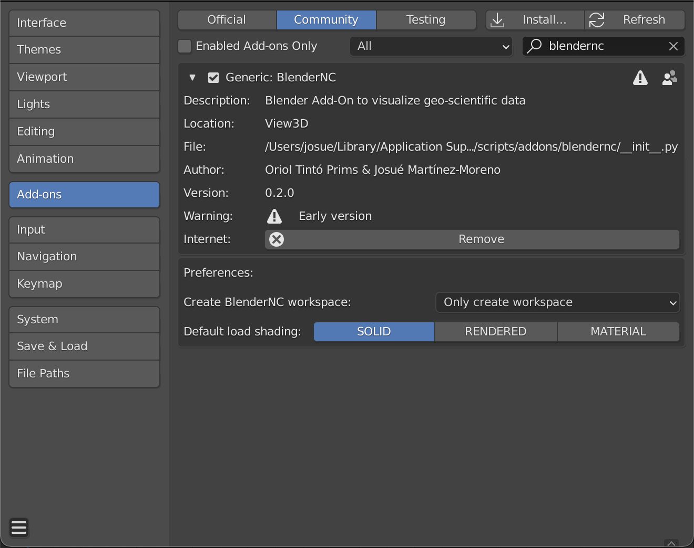
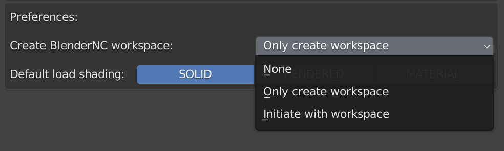
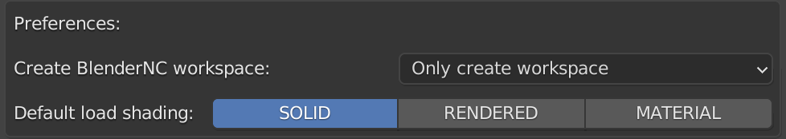

=====================
BlenderNC Preferences
=====================

BlenderNC allows the user to set up some preferences while using this add-on:

Workspace:
##########

BlenderNC can create a workspace for the user, the following options:

- None:
    No workspace is created
- Only create workspace (Default):
    space is created when Blender is initiated, however, the user will remain in the default workspace (Blender default: `Layout`) or their previously saved workspace.
- Initiate with workspace:
    Workspace is created when Blender is initiated and it will be preselected for the user.

Select your preferred option by clicking over it.

Shading:
########
BlenderNC allows the user to select their preferred shading:

- Solid (Default):
    Default Blender shading.
- Rendered:
    Material and light paths are shown (Evee render is recommended).
- Material:
    Material is shown, no lights are computed.

.. warning:: Rendered can affect the performance of Blender and BlenderNC.

