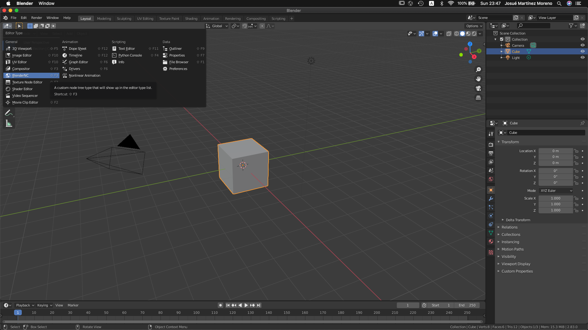
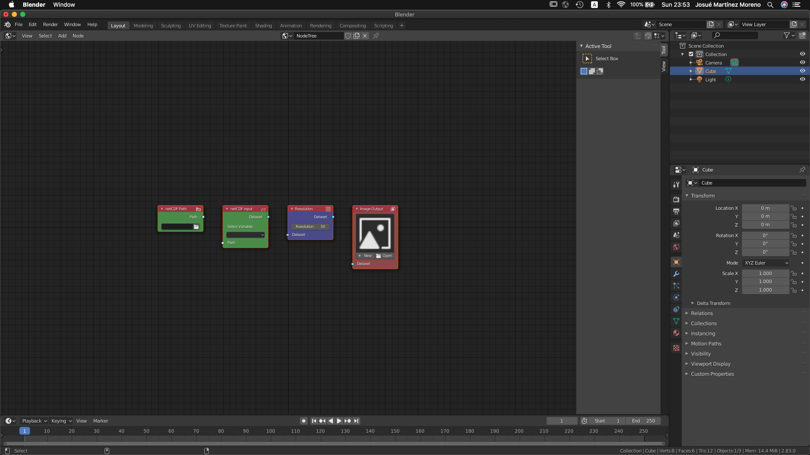

PRO mode!
#########

The first step to becoming a PRO is to access the **BlenderNC** node editor 
on the top left corner (drop down menu) and select BlenderNC:

Next, create a new editor on the middle top of the workspace:

.. image:: ../images/blendernc_editor_new.png
  :width: 80%
  :alt: BlenderNC new editor

Finally, add the basic nodes by pressing (shift + A) and selecting Shortcuts > Create Basic Nodes:

- Path node 
- Input node 
- Resolution node
- Output node

.. image:: ../images/blendernc_create_basic_nodes.png
  :width: 80%
  :alt: BlenderNC create nodes

Any data visualization requires at least these nodes. 

Now you are ready to start loading netCDFs. 
Let's move to the first tutorial:

- Import Gebco Data (WIP)
- Animate Sea Surface Height Data (WIP)
- Animated Ocean-Land Mask (WIP)
- Composites (Ocean & Atmosphere) (WIP)